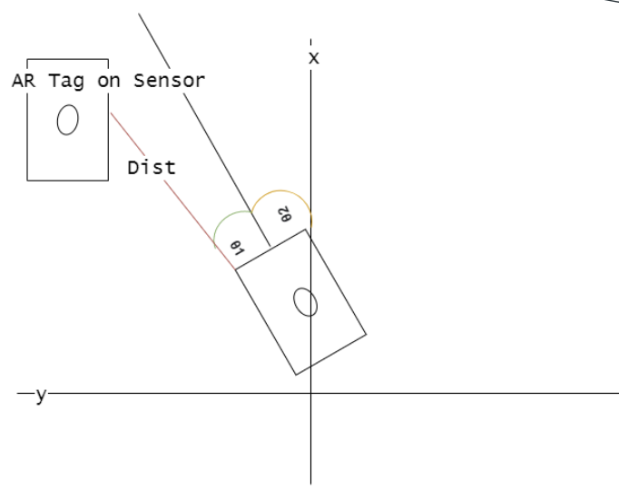
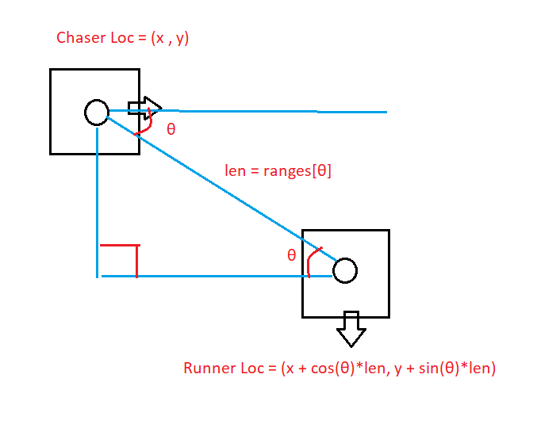

# Project Description

Our project consists of two robots (a chaser and a runner) playing tag. The runner moves in random directions and maintains that direction for a period of time. The chaser uses a path prediction algorithm to estimate where the runner will be and attempts to catch it at that future location.

The chaser achieves this by storing a history of the runner's locations and using statistical extrapolation algorithms to predict the runner's path. Then, it uses proportional control to move toward the predicted coordinate of the runner. Once the chaser tags the runner with its bumper sensor, the chaser stops.

This project is interesting because it solves problems that person-following code cannot. Specifically, our model can predict future paths more accurately, allowing the chaser to tag the runner even at a lower speed.

---

# System Architecture

## Runner Detection

The object tracking algorithm is implemented in `detect_runner.py`, specifically in the `process_scan()` and `image_callback()` functions. The runner has three AR tags, one on each side, allowing the chaser to detect it from multiple angles.

When one or more AR tags are detected:
- We find the average location of the visible tags in the camera frame (left, right, etc.).
- This helps estimate a LIDAR angle for more precise distance measurement.
- The estimated distance and angle, along with a timestamp, are published to the `angle_vectors` topic for use in `prediction.py`.

## Path Prediction

Path prediction is handled entirely in `prediction.py`.

Steps:
1. Collect runner position history as (x, y) coordinates.
2. Track chaser’s position using odometry, setting the initial location as (0, 0).
3. Use laser scan data and AR detection data to compute the runner’s (x, y) location.
4. Add each calculated coordinate to a history array with a timestamp.

We visualize the position history as yellow pose arrows in RVIZ, and after gathering enough data points (e.g., 20), we:
- Perform a linear regression against timestamps.
- Use this to estimate where the runner will be in the future, depending on distance and chaser's max speed.
- The predicted position is displayed as a green marker in RVIZ.

We also correct for the chaser's rotation by combining the target angle with the chaser’s rotation from the x-axis.

## Chaser Movement

Once the runner’s predicted location is calculated, the chaser moves toward it using proportional control. This logic is also implemented in `prediction.py`.

## Runner Behavior

The runner:
- Moves in a straight line.
- At random intervals, rotates to a random angle and drives forward again.
- Avoids obstacles like walls.

This behavior is implemented in `runner.py`.

## Bumping

Bumper detection is implemented in `prediction.py`:
- We subscribe to the `sensor_state` topic.
- In the `bumper_callback()` function, we detect bumper state changes.
- If touched, we set `self.bumped = True` to stop the chaser.

---

# Execution

## Launching the Chaser

1. Run `roscore`.
2. SSH into the robot, run `set_ip ???` and `bringup`.
3. SSH again and run `set_ip ???` and `bringup_cam`.
4. Republish the image: `rosrun image_transport republish compressed in:=raspicam_node/image raw out:=camera/rgb/image_raw`
5. Launch: `roslaunch tag_final_project prediction.launch`  
   *(or use `prediction_no_rviz.launch` if you don’t want RVIZ)*

## Launching the Runner

1. Run `roscore`.
2. SSH into the robot, run `set_ip ???` and `bringup`.
3. Run `rosrun tag_final_project runner.py`.

> Note: `drive.py`, `bump_sensor.py`, and `test.py` are for debugging purposes only.

---

# Challenges

We faced several challenges:

- **AR tag visibility issues:** due to camera lag caused missing runner data points.
- **Chaser LiDAR range:** is limited to 3 meters, requiring the runner to stay within range for accurate tracking.
- **Bumper sensor coverage:** was limited, so we extended the sensor surface using cardboard to improve tag detection.

# Future Work

We plan to:
- Detect runner orientation using AR tags on all sides and integrate it into prediction logic.
- Improve the prediction algorithm with non-linear path models like zig-zag behavior or Hidden Markov Models.
- Implement a full game of tag, where roles switch post-tag, requiring sensors on both robots.

# Takeaways

- We learned how to attach new sensors (e.g. touch sensor) to the OpenCR board.
- We learned how to utilize RVIZ to debug our project code and visualize the runner’s travel history and predicted path.
- We learned how to employ a prediction model to estimate the future location of a runner based on past trajectory data.

[View Project on Github](https://github.com/diogoviveiros/Tag_Final_Project)
